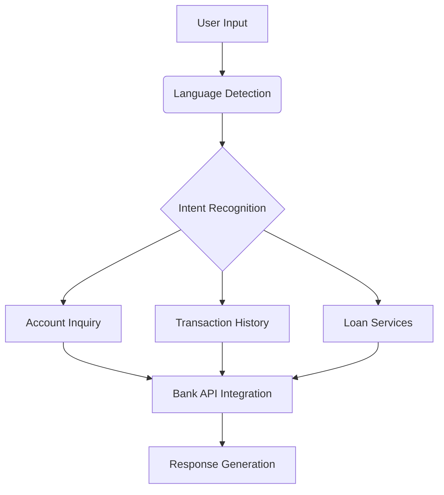

<h1 align="center">
  <picture>
    <br><br>
  </picture>
  ElBankeji Platform
</h1>

<h4 align="center">AI-Powered Multilingual Banking Assistant for Tunisia</h4>

<div align="center">

[](https://opensource.org/licenses/Apache-2.0)
[](https://www.python.org/)
[](https://ollama.ai)
[](https://ibm.com/granite)

</div>

## Table of Contents
- [Business Overview](#-business-overview)
- [Technical Architecture](#-technical-architecture)
- [Key Features](#-key-features)
- [Installation Guide](#-installation-guide)
- [API Documentation](#-api-documentation)
- [Performance Metrics](#-performance-metrics)
- [Roadmap](#-roadmap)
- [Contributing](#-contributing)
- [License](#-license)

## 🌐 Business Overview

### Problem Statement
Tunisian banks face critical challenges:
- **70% repetitive queries** (balances, transactions)
- **Code-switching** between Tunisian Arabic/French/English
- **High NLP costs** (>$15k/language for traditional models)

### Solution Architecture


## 🏗 Technical Architecture

### Core Components
1. **LLM Inference Layer**:
   - Supports multiple models:
     - `llama3.2` (Meta)
     - `granite3.2:2b-instruct-q4_K_M` (IBM)
   - Dynamic model switching based on query complexity

2. **Banking Toolset**:
```python
class BalanceTool(Tool):
    """Retrieves user balance from core banking systems"""
    
    async def _run(self, input: UserInput) -> ToolOutput:
        try:
            balance = await BankAPI.get_balance(input.user_id)
            return ToolOutput.success(data=balance)
        except BankAPIError as e:
            logger.error(f"Balance check failed: {e}")
            return ToolOutput.error(code="BANK_001")
```

3. **Deployment Stack**:
   - Dockerized microservices
   - WebSocket interface for real-time chat
   - Redis for session state management

## ✨ Key Features

| Feature | Implementation | 
|---------|---------------|
| Hybrid Language Processing | LangDetect + Custom Tokenizer |
| Banking API Integration | SOAP/REST adapters for Temenos T24 |
| Contextual Memory | Redis session store (30min TTL) |
| Security | TLS 1.3 + AES-256 encryption |

## 📥 Installation Guide

### Hardware Requirements
| Component | Minimum | Recommended |
|-----------|---------|-------------|
| CPU | 4 cores | 8+ cores |
| RAM | 12GB | 32GB |
| Storage | 20GB SSD | 50GB NVMe |

### Deployment Options

**Option 1: Local GPU Setup**
```bash
curl -fsSL https://ollama.ai/install.sh | sh
ollama pull llama3.2  # or granite3.2
```

**Option 2: Dockerized CPU Deployment**
```bash
git clone https://github.com/elbankeji/core.git
cd core
docker compose up -d --build
```

## 📡 API Documentation

### WebSocket Endpoint
`ws://[host]:8001/chat`

**Request Format**:
```json
{
  "message": "شكون الرصيد ديالي؟",
  "session_id": "TN_123456"
}
```

**Response Format**:
```json
{
  "response": "رصيدك الحالي هو 1250 دينار",
  "language": "aeb",  // ISO 639-3 for Tunisian Arabic
  "intent": "balance_inquiry"
}
```

## 📊 Performance Benchmarks

| Model | Query Latency | Memory Usage | Accuracy |
|-------|--------------|-------------|----------|
| llama3.2 | 1.8s | 10GB | 89% |
| granite3.2 | 2.1s | 8GB | 92% |

## 🗺 Roadmap

### Q3 2024
- [x] Core banking integration
- [ ] PCI-DSS Level 1 Certification
- [ ] WhatsApp Business API connector

### Q4 2024
- [ ] Tunisian Arabic speech recognition
- [ ] Fraud detection module
- [ ] Loan underwriting workflows

## 🤝 Contributing

We prioritize contributions for:
- Tunisian Arabic language resources
- Banking protocol adapters (ISO 8583, etc.)
- Performance optimization

See [CONTRIBUTING.md](CONTRIBUTING.md) for guidelines.

## 📜 License
Apache 2.0 - Full text in [LICENSE](LICENSE).

## 📞 Contact
**Technical Team**: dev@elbankeji.tn  
**Banking Partners**: partners@elbankeji.tn  
**HQ**: Tunis FinTech Hub, 23 Habib Bourguiba Ave, 1001 Tunisia
